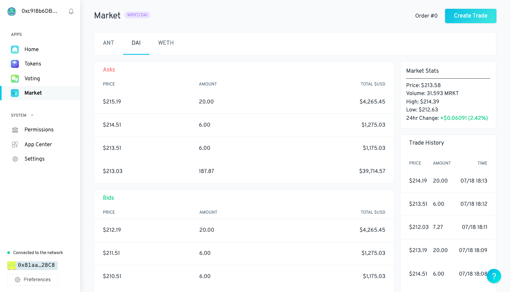

# Market App

> [0x](https://0x.org) relayer interface for [Aragon](https://www.aragon.org) DAOs



## Background

This app is a PoC experimenting with 0x relayer integration for Aragon DAOs and is in a very early alpha stage: do **NOT** use in production unless you know what you're doing.

## Install

```sh
git clone https://github.com/proofoftom/aragon-market.git
```

```sh
cd aragon-market
```

```sh
npm install
```

## Run the template

```sh
npx aragon run --template Template --template-init @ARAGON_ENS
```

## Running your app

### Using HTTP

Running your app using HTTP will allow for a faster development process of your app's front-end, as it can be hot-reloaded without the need to execute `aragon run` every time a change is made.

- First start your app's development server running `npm run start:app`, and keep that process running. By default it will rebuild the app and reload the server when changes to the source are made.

- After that, you can run `npm run start:http` or `npm run start:http:template` which will compile your app's contracts, publish the app locally and create a DAO. You will need to stop it and run it again after making changes to your smart contracts.

Changes to the app's background script (`app/script.js`) cannot be hot-reloaded, after making changes to the script, you will need to either restart the development server (`npm run start:app`) or rebuild the script `npm run build:script`.

### Using IPFS

Running your app using IPFS will mimic the production environment that will be used for running your app. `npm run start:ipfs` will run your app using IPFS. Whenever a change is made to any file in your front-end, a new version of the app needs to be published, so the command needs to be restarted.

## What's in this boilerplate?

### Structure

This boilerplate has the following structure:

```md
root
├── app
├ ├── src
├ └── package.json
├── contracts
├ ├── CounterApp.sol
├ └── Template.sol
├── migration
├── test
├── arapp.json
├── manifest.json
├── truffle.js
└── package.json
```

- **app**: Frontend folder. Completely encapsulated, has its own package.json and dependencies.
  - **src**: Source files.
  - [**package.json**](https://docs.npmjs.com/creating-a-package-json-file): Frontend npm configuration file.
- **contracts**: Smart Constracts folder.
  - `CounterApp.sol`: Aragon app contract example.
  - `Template.sol`: [Aragon Template](https://hack.aragon.org/docs/templates-intro) to deploy a fully functional DAO.
- [**migrations**](https://truffleframework.com/docs/truffle/getting-started/running-migrations): Migrations folder.
- **test**: Tests folder.
- [**arapp.json**](https://hack.aragon.org/docs/cli-global-confg#the-arappjson-file): Aragon configuration file. Includes Aragon-specific metadata for your app.
- [**manifest.json**](https://hack.aragon.org/docs/cli-global-confg#the-manifestjson-file): Aragon configuration file. Includes web-specific configurations.
- [**truffle.js**](https://truffleframework.com/docs/truffle/reference/configuration): Truffle configuration file.
- [**package.json**](https://docs.npmjs.com/creating-a-package-json-file): Main npm configuration file.

### npm Scripts

- **start** or **start:ipfs**: Runs your app inside a DAO served from IPFS
- **start:http**: Runs your app inside a DAO served with HTTP (hot reloading)
- **start:ipfs:template**: Creates a DAO with the [Template](https://github.com/aragon/aragon-react-boilerplate/blob/master/contracts/Template.sol) and serves the app from IPFS
- **start:http:template**: Creates a DAO with the [Template](https://github.com/aragon/aragon-react-boilerplate/blob/master/contracts/Template.sol) and serves the app with HTTP (hot reloading)
- **prepare**: Installs dependencies of the front-end
- **start:app**: Starts a development server for your app
- **compile**: Compiles the smart contracts
- **build**: Builds the front-end and background script
- **test**: Runs tests for the contracts
- **publish:patch**: Releases a patch version to aragonPM (only frontend/content changes allowed)
- **publish:minor**: Releases a minor version to aragonPM (only frontend/content changes allowed)
- **publish:major**: Releases a major version to aragonPM (frontend **and** contract changes)
- **versions**: Checks the currently installed versions of the app
- **lint**: Checks the app and the contracts for linting errors
- **lint:fix**: Fixes the lint errors that can be resolved automatically
- **coverage**: Runs the tests for the contracts and creates a report

### Libraries

- [**@aragon/os**](https://github.com/aragon/aragonos): Aragon interfaces
- [**@aragon/api**](https://github.com/aragon/aragon.js/tree/master/packages/aragon-api): Wrapper for Aragon application RPC
- [**@aragon/ui**](https://github.com/aragon/aragon-ui): Aragon UI components (in React)

## What you can do with this boilerplate?

### Publish

You can publish you app on [aragonPM](https://hack.aragon.org/docs/apm). See how in our [publish guide](https://hack.aragon.org/docs/guides-publish).

> **Note**<br>
> The [Template](https://github.com/aragon/aragon-react-boilerplate/blob/master/contracts/Template.sol) will not be published.

### Using a different Ethereum account

You can use a different account to interact with you app. [Check the documentation](https://hack.aragon.org/docs/guides-faq#set-a-private-key).

### Propagate content

You can propagate the content of your app on IPFS. Learn more in our [troubleshooting guide](https://hack.aragon.org/docs/guides-faq#propagating-your-content-hash-through-ipfs) or use the `aragon ipfs propagate` command:

```
npx aragon ipfs propagate <cid>
```

Where `cid` is your content id hash (this will be displayed after publishing).
